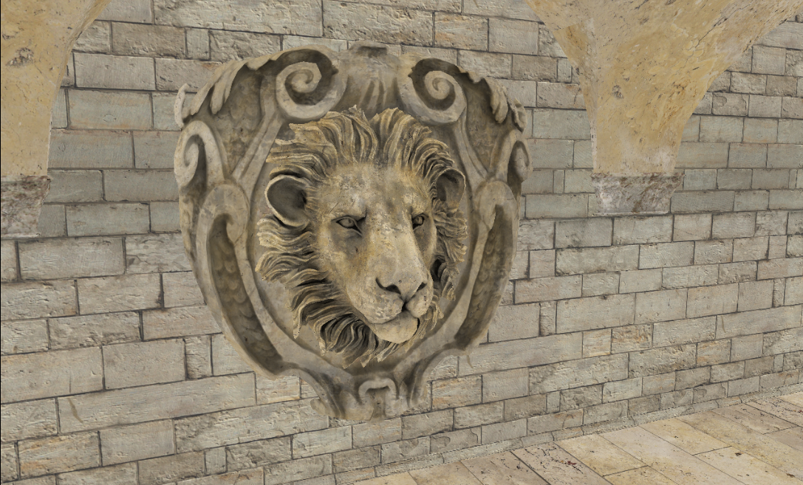
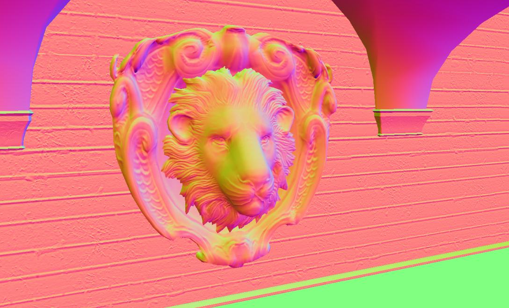
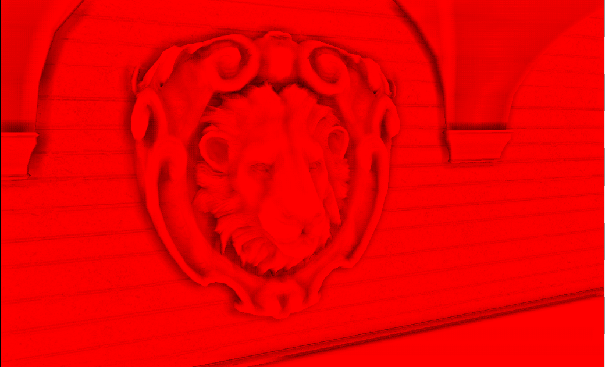
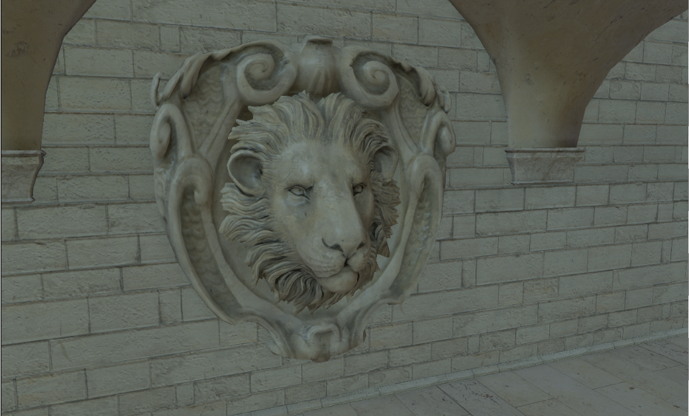
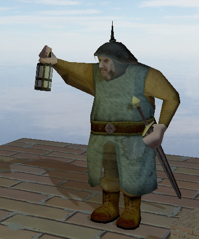
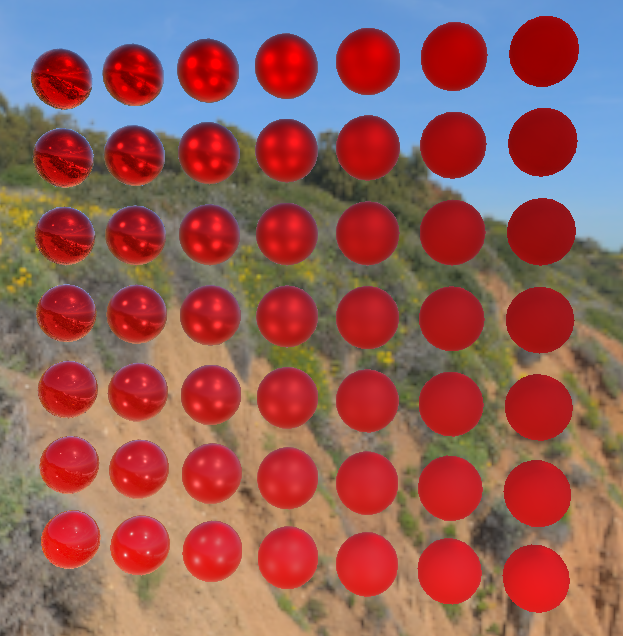

# PPG

This is a Dx11 rendering engine for self learning.

* Forward and Deferred Rendering
* PBR + IBL
* Directional, Spot, Point light source
* Texture, Specular, Normal & Bump Mapping
* Skybox
* Directional Shadow Map
* Sprites
* SSAO
* Skeletal Animation

## Screen Shots

