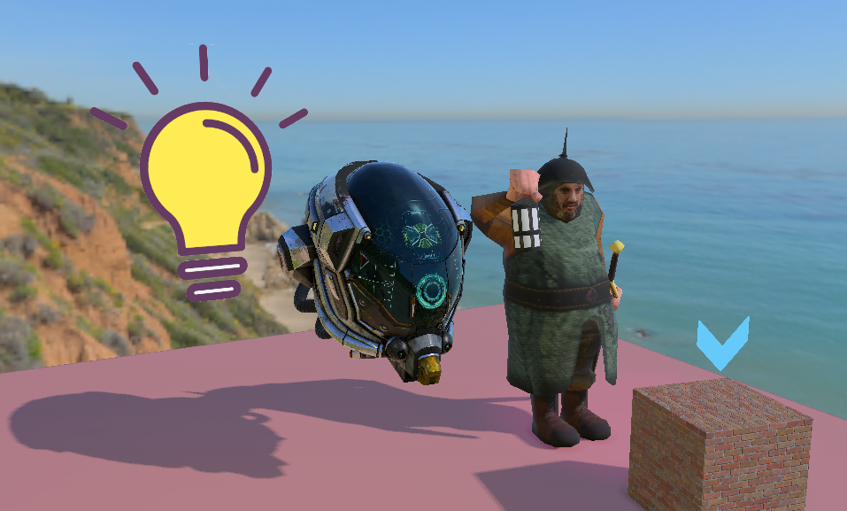

# PPG

This is a Dx11 rendering engine for self learning.

Implemented:
* Forward Rendering
* ~~Phong Shading~~ PBR (WIP)
* Models
* Directional, Spot, Point light source
* Texture, Specular, Normal & Bump Mapping
* Skybox
* Directional Shadow Map
* Sprites
* Deferred Rendering
* SSAO
